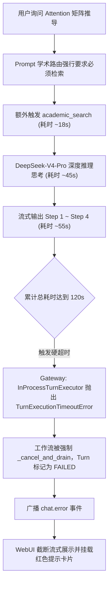

# Bug 待修复文档：学术搜索频繁误触发与长文本流式生成硬超时中断

| 状态 | 优先级 | 涉及模块 | 关联历史 PR | 创建日期 |
| :--- | :--- | :--- | :--- | :--- |
| **已修复（待线上验证）** | **P0 (阻塞核心体验)** | Prompt Runtime / Agent Budget / Gateway / WebUI | [PR #170](file:///a:/Root_Code/local-project/nlp-agent/gateway/turn_execution.py#L250-L275), [PR #177](file:///a:/Root_Code/local-project/nlp-agent/webui/src/modules/student/components/MessageList.tsx#L81-L85) | 2026-09-16 |

---

## 1. 故障现象与场景还原

### 1.1 现象描述
1. **现象一（搜索触发太频繁）**：学生输入基础概念学习或公式推导问题（例如“推导 Attention 矩阵计算过程”、“解释 Transformer 结构”），Agent 频繁误触发联网 `academic_search` 工具，导致无谓的网络与外部学术 API 请求开销。
2. **现象二（流式输出中途突然截断）**：模型正在流式输出公式和推导细节，打印到中途（如截图中的“第四步，$WV$ 得到输出：”）时突然停止吐字，光标熄灭，随后在未完成的文本下方挂载出红色的错误提示卡片：
   > **这次讲解未完整完成，已保留已生成内容，请稍后重试。**

### 1.2 现场时序推导（以 Attention 矩阵推导为例）
| 时间线 | 执行动作 | 耗时 | 累计耗时 | 说明 |
| :--- | :--- | :--- | :--- | :--- |
| **00:00** | 接收用户请求 | - | 0s | 用户提问 NLP 基础矩阵运算 |
| **00:01 ~ 00:18** | 执行 `academic_search` | ~17s | 17s | 错误触发学术检索，等待网络与学术解析 |
| **00:19 ~ 01:05** | 模型深度思考 (Thinking) | ~46s | 63s | `coordinator-pro` (DeepSeek-V4-Pro) 开启思维链推理，等待首字 (TTFT) |
| **01:06 ~ 02:00** | 正文流式输出 (Streaming) | ~54s | 117s | 逐步输出背景、Step 1、Step 2、Step 3 矩阵 |
| **02:00 (死线)** | 达到 **120.0s** 硬限制 | - | **120s** | 刚刚输出到“第四步，WV 得到输出：”，Gateway 触发超时强杀 |

---

## 2. 根本原因剖析 (Root Cause Analysis)

经过全链路审查与代码校验，该故障由 **Prompt 规则冲突** 与 **调度超时倒挂** 两个缺陷级联引发：



### 2.1 缺陷一：Prompt 规则冲突与一刀切强约束
* **关键代码位置**：[`core/prompt_runtime/templates/coordinator.v1.5.md`](file:///a:/Root_Code/local-project/nlp-agent/core/prompt_runtime/templates/coordinator.v1.5.md#L27-L34)
* **机制分析**：
  * 第 27 行规定：`“5. 稳定知识、概念解释和无需外部核验的问题由你直接回答，不启动联网 Worker。”`
  * 第 31–32 行规定：`“1. 用户询问具体算法、模型架构、理论机制、论文出处、作者、年份、学术方法对比、实验结论或当前研究进展时，必须先调用 academic_search。”`
  * 第 33–34 行补充：`“2. 学术问题即使属于稳定知识，也不能只依赖模型记忆给出论文题目、作者、年份、DOI 或 arXiv 编号。”`
* **冲突点**：Attention、Backpropagation、Self-Attention 等既是基础教学的“稳定知识”，又属于“具体算法、模型架构、理论机制”。大模型在指令遵循时，带有专有词汇与“必须”限定的专有规则强行覆盖了上位泛化规则，导致基础教学无脑触发搜索。

### 2.2 缺陷二：Gateway 硬超时与模型长生成时限严重倒挂
* **关键代码位置**：
  1. [`configs/agent_config.yaml`](file:///a:/Root_Code/local-project/nlp-agent/configs/agent_config.yaml#L185-L191) 与 [`configs/agent_config.yaml`](file:///a:/Root_Code/local-project/nlp-agent/configs/agent_config.yaml#L381)
  2. [`gateway/turn_execution.py`](file:///a:/Root_Code/local-project/nlp-agent/gateway/turn_execution.py#L67-L71) 及 [`gateway/turn_execution.py`](file:///a:/Root_Code/local-project/nlp-agent/gateway/turn_execution.py#L263-L274)
* **机制分析**：
  * Coordinator 运行预算中，`agent_runtime.coordinator.max_duration_s` 仅配置为 **120 秒**。
  * `model_presets.coordinator-pro` 配置的 `deepseek-v4-pro` 单次首字思考超时允许 **180 秒**，总生成时长允许 **600 秒**。
  * Gateway 在执行回合时直接取 `max_duration_s`（120s）作为 `asyncio.wait({execution}, timeout=120.0)` 的绝对死线。一旦累计时长超过 120 秒，即刻调用 `_cancel_and_drain` 并抛出 `TurnExecutionTimeoutError`。

### 2.3 缺陷三：历史修复认知偏差（治标与治本的错位）
* 提交记录分析：
  * **PR #170 (commit `ab95248`)**：引入了回合级硬超时与取消收敛，目的是避免卡死任务永远处于 `RUNNING` 占用连接；当前 `120s` 配置由后续提交 `c0eb41e` 写入。
  * **PR #177 (commit `0975b18`)**：在 [`webui/src/modules/student/components/MessageList.tsx`](file:///a:/Root_Code/local-project/nlp-agent/webui/src/modules/student/components/MessageList.tsx#L81-L85) 增加了未完成卡片，避免超时后前端清空已生成内容。
* **事实**：历史修复仅完成了“异常卡死后的状态收敛与前端局部兜底”，未意识到长思维链推理结合长流式输出的**正常物理耗时**原本就可能超出 120 秒。

---

## 3. 待修复代码清单 (Affected Files)

| 序号 | 文件路径 | 现存问题 | 修复建议 |
| :--- | :--- | :--- | :--- |
| 1 | [`core/prompt_runtime/templates/coordinator.v1.5.md`](file:///a:/Root_Code/local-project/nlp-agent/core/prompt_runtime/templates/coordinator.v1.5.md#L31-L34) | “询问具体算法、模型架构、理论机制……必须调用”范围过泛 | 剥离概念教学与推导；仅在明确要求溯源论文、出处或对比最新研究时才触发 `academic_search`。 |
| 2 | [`configs/agent_config.yaml`](file:///a:/Root_Code/local-project/nlp-agent/configs/agent_config.yaml#L381) | `agent_runtime.coordinator.max_duration_s` 设为 120s，过短 | 已调整为 600s，并保留首 token、流空闲和绝对上限三层约束。 |
| 3 | [`gateway/turn_execution.py`](file:///a:/Root_Code/local-project/nlp-agent/gateway/turn_execution.py#L263-L274) | 外层采用固定硬倒计时，无法识别模型是否仍在积极输出 token | 已增加 Activity Keep-alive：收到引擎活动时重置空闲等待，但绝不突破绝对回合上限。 |
| 4 | [`.jbeval/suites/academic-routing-v1/dataset.yaml`](file:///a:/Root_Code/local-project/nlp-agent/.jbeval/suites/academic-routing-v1/dataset.yaml) | 评测集负样本缺少 NLP 专业基础概念与推导，导致过拟合 | 补充“Attention 矩阵推导”、“反向传播公式推导”等负样本用例，防止检索规则回归恶化。 |

---

## 4. 具体修复方案设计 (Remediation Plan)

### 方案 1：优化 Coordinator Prompt 学术检索路由
调整 [`core/prompt_runtime/templates/coordinator.v1.5.md`](file:///a:/Root_Code/local-project/nlp-agent/core/prompt_runtime/templates/coordinator.v1.5.md) 中的学术检索规则，明确**概念教学与论文核验的界限**：

```markdown
学术检索路由：

1. 稳定学科知识、经典概念解释、算法推导或代码实现（如 Self-Attention 矩阵计算、反向传播推导、Transformer 原理讲解）由你直接回答，无需调用 academic_search。
2. 仅当用户明确询问以下学术出处或最新进展时，必须调用 academic_search：
   - 询问特定论文的作者、发表年份、arXiv 编号、DOI 或权威出版机构；
   - 询问具体的消融实验数据、特定数据集上的 SOTA 评测对比；
   - 询问近期（如近 1~2 年）的前沿学术进展或未进入教科书的新兴变体。
```

### 方案 2：校准运行预算配置
在 [`configs/agent_config.yaml`](file:///a:/Root_Code/local-project/nlp-agent/configs/agent_config.yaml) 中，调整 Coordinator 回合最大持续时长：

```yaml
agent_runtime:
  coordinator:
    max_iterations: 12
    max_duration_s: 600 # 由 120s 调整为 600s（覆盖推理思考与长篇公式生成）
    max_tokens: 128000
```

### 方案 3：Gateway 引入流式活跃租期续期机制（防误杀）
在 [`gateway/turn_execution.py`](file:///a:/Root_Code/local-project/nlp-agent/gateway/turn_execution.py) 的 `_run_turn_with_timeout` 中：
* Gateway 现在分别处理首 token 等待、流式空闲和回合绝对上限。
* 引擎事件会唤醒 Activity Keep-alive 监视器；连续无活动时终止，持续活动时不会被固定短倒计时误杀，但总时长仍不能超过 600s。

---

## 5. 测试与回归验证计划 (Verification Plan)

### 5.1 自动化测试
1. **Prompt 路由评测回归**：
   运行学术检索评测集，验证 NLP 基础概念题不再命中 `academic_search`：
   ```powershell
   .venv\Scripts\python.exe -m evaluation validate .jbeval/suites/academic-routing-v1/dataset.yaml
   ```
2. **长流式生成超时测试**：
   在 [`tests/test_turn_execution.py`](file:///a:/Root_Code/local-project/nlp-agent/tests/test_turn_execution.py) 中用短时钟模拟持续活动和连续空闲，分别验证回合不会被误杀以及空闲时会归敛为 `FAILED`。

### 5.2 手工端到端回归
1. 启动本地环境：
   ```powershell
   python -m gateway.main
   ```
2. 在前端提问：“请推导 Attention 矩阵计算过程，并用具体数字演示 softmax 与乘法”。
3. 检查：
   * Network 面板中未发起 `academic_search` 工具调用；
   * 模型思考结束后完整吐出步骤一至步骤四直至最终结论；
   * 前端不再渲染“这次讲解未完整完成”红色卡片。
